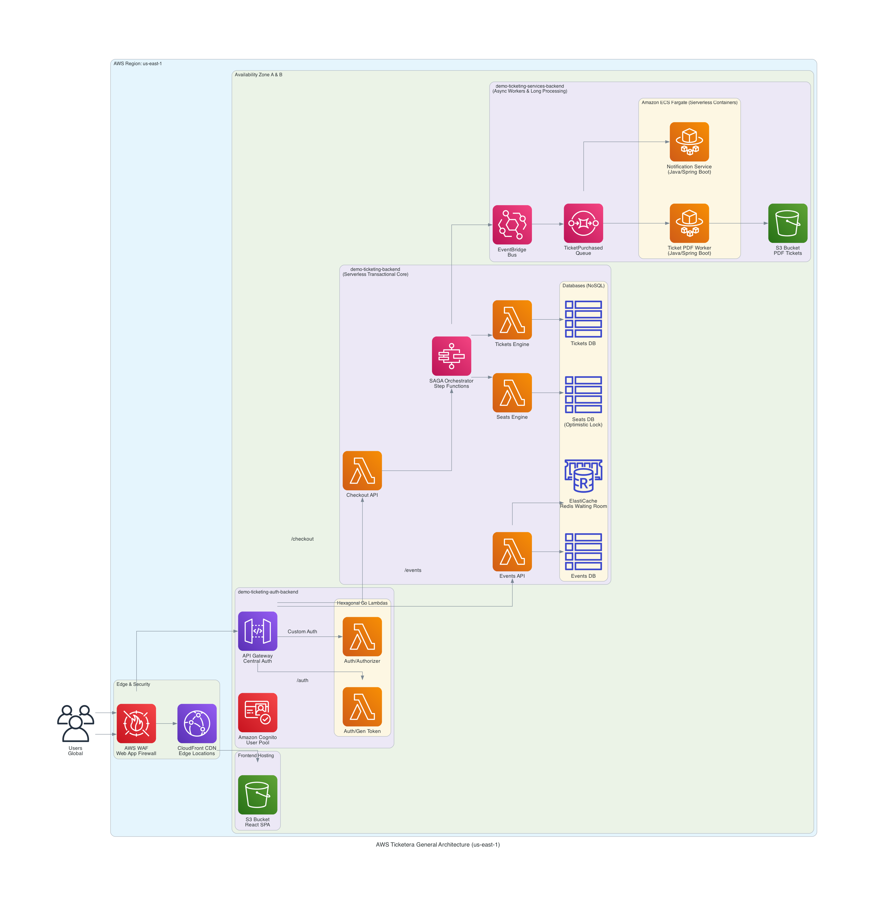
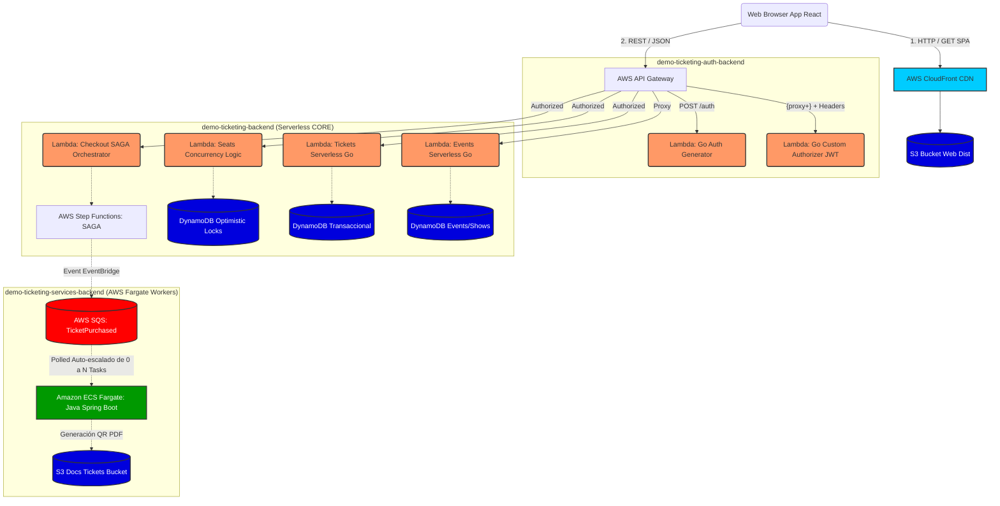
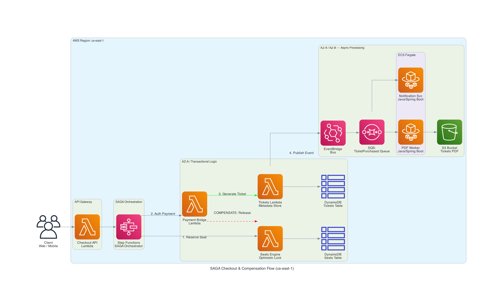
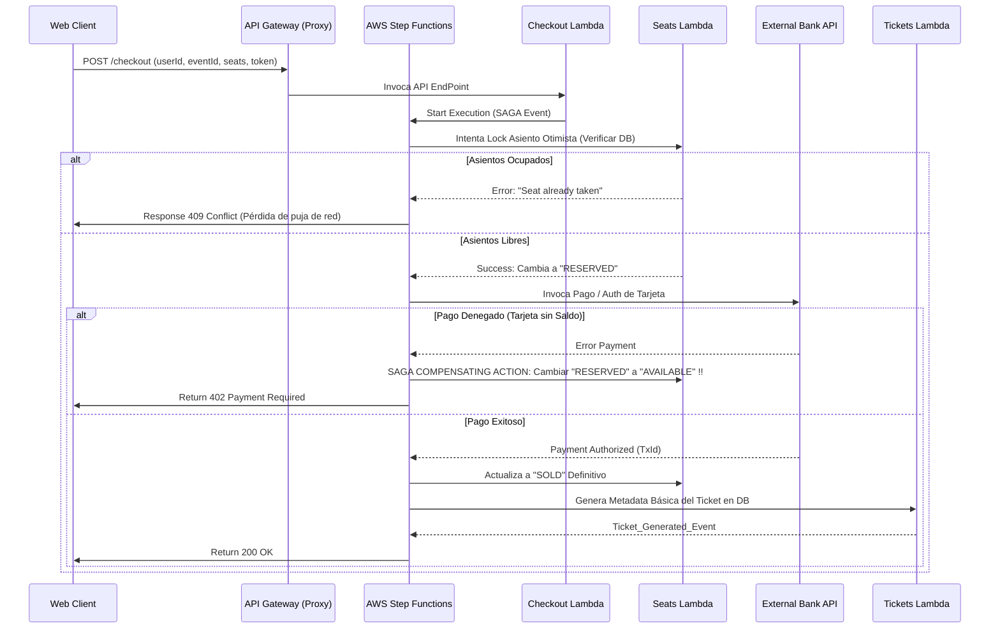
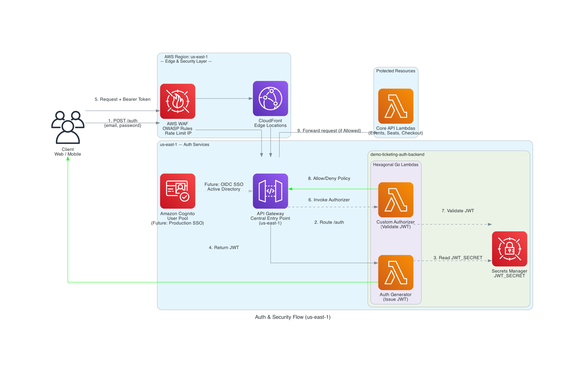
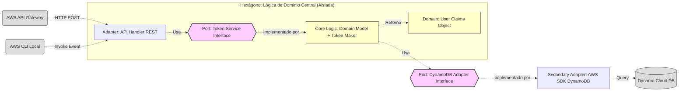
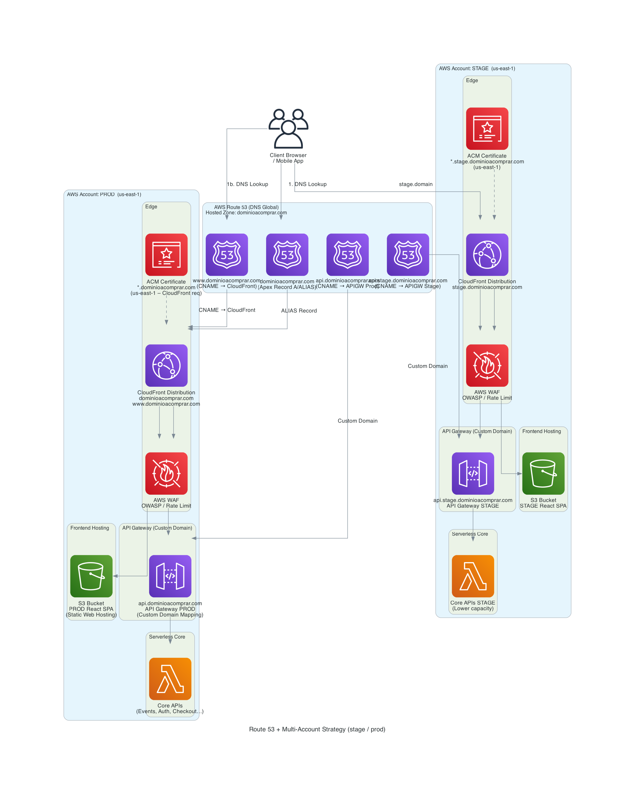
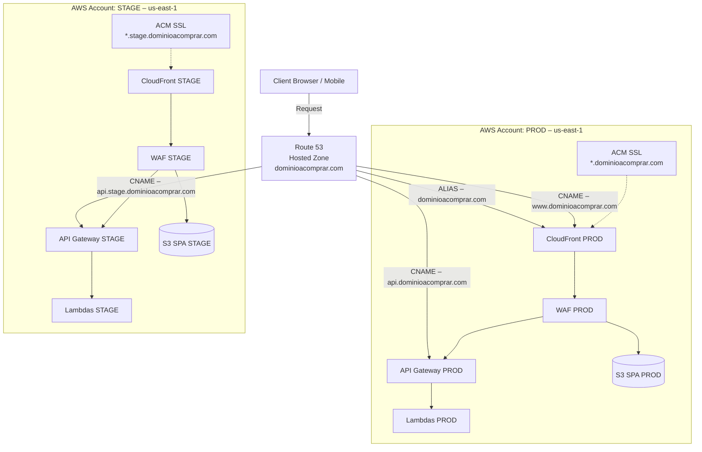
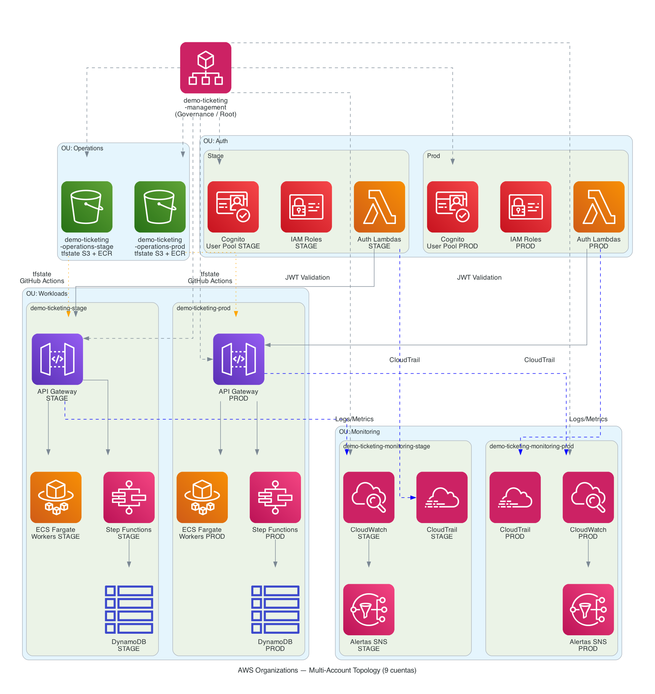
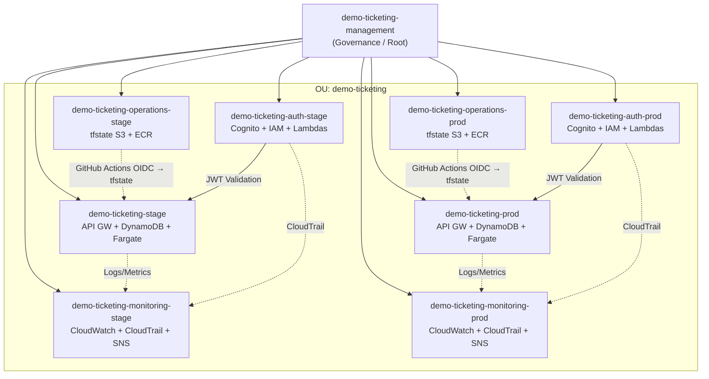

# Diagramas de Arquitectura

Este documento contiene los diagramas de arquitectura de la plataforma `demo-ticketing`.

Cada sección incluye **dos formatos**:
- 🖼️ **Diagrama PNG con íconos AWS oficiales** (generado con la librería `diagrams` de Python + Graphviz)
- 📐 **Diagrama Mermaid** (para edición rápida inline directamente en GitHub)

**Región principal:** `us-east-1` (N. Virginia) — *Reason: mayor disponibilidad de servicios Free Tier y latencia optimizada para LATAM.*

---

## Requisitos para regenerar los diagramas PNG

```bash
brew install graphviz
python3 -m venv venv && source venv/bin/activate
pip install diagrams
cd assets/diagrams/scripts
python3 generate_diagram.py
python3 generate_saga_diagram.py
python3 generate_auth_diagram.py
python3 generate_accounts_diagram.py 
python3 generate_route53_diagram.py
```

## 1. Arquitectura de Despliegue General en AWS

Este diagrama ilustra cómo las solicitudes de los usuarios fluyen desde el browser a través de **WAF → CloudFront → API Gateway** hacia los distintos microservicios. Detalla:
- **Región:** `us-east-1`, **AZ:** `us-east-1a` y `us-east-1b`
- **WAF** para protección OWASP en borde
- **CloudFront** para CDN del Frontend SPA
- **API Gateway** como único punto de entrada
- **Lambdas Go** para lógica de Auth y APIs Core
- **ECS Fargate** para workers Java de larga duración
- **DynamoDB** (multi-AZ) para almacenamiento NoSQL
- **EventBridge + SQS** como bus de eventos asíncronos

### 🖼️ Diagrama AWS




---

## 2. Flujo de Transacción SAGA (Proceso de Checkout y Compensaciones)

Describe el mecanismo Core de compra de Ticketera: un patrón de microservicios distribuido "Saga" (Orquestado por Step Functions y Lambda), garantizando consistencia atómica sin bloquear registros globalmente (Optimistic Locking). Detalla:
- **Región:** `us-east-1`, **AZ:** `us-east-1a` (transaccional) y `us-east-1b` (async workers)
- **Compensating Actions** en caso de fallo de pago
- **DynamoDB** Optimistic Lock para asientos
- **SQS + ECS Fargate** para procesamiento asincrónico tras el pago exitoso

### 🖼️ Diagrama AWS


### 📐 Diagrama Mermaid


---

## 3. Auth & Security Flow

Visualiza el flujo de autenticación y autorización de la plataforma de extremo a extremo. Detalla:
- **WAF** como primer filtro OWASP en borde
- **CloudFront** como capa intermedia distribuidora de peticiones
- **API Gateway** enrutando a las Lambdas especializadas de Auth
- **Custom Authorizer** (Go/Hexagonal) validando JWT en cada request protegido
- **Secrets Manager** almacenando el secreto `JWT_SECRET` de forma segura
- **Cognito** preparado para futura integración de SSO/Active Directory

### 🖼️ Diagrama AWS


### 📐 Diagrama Mermaid (Hexagonal Architecture)


---

## 4. Route 53 — DNS, Dominio y Multi-Account Strategy (stage / prod)

Describe cómo el dominio comprado en Route 53 se conecta con los distintos ambientes de AWS. Detalla:
- **Route 53 Hosted Zone** como DNS autoritativo de `dominioacomprar.com`
- **Registros DNS:**
  - `dominioacomprar.com` → ALIAS Apex → CloudFront PROD
  - `www.dominioacomprar.com` → CNAME → CloudFront PROD
  - `api.dominioacomprar.com` → CNAME → API Gateway PROD
  - `api.stage.dominioacomprar.com` → CNAME → API Gateway STAGE
- **ACM** emitiendo certificados wildcard `*.dominioacomprar.com` y `*.stage.dominioacomprar.com` en `us-east-1`
- **WAF** declarado independientemente en cada cuenta AWS (PROD / STAGE)
- **Cuentas AWS PROD y STAGE** completamente aisladas entre sí

### 🖼️ Diagrama AWS


### 📐 Diagrama Mermaid



---

## Mapa Rápido: Subdominios por Ambiente

| Subdominio | Ambiente | Destino |
|---|---|---|
| `dominioacomprar.com` | PROD | CloudFront → S3 React SPA |
| `www.dominioacomprar.com` | PROD | CloudFront → S3 React SPA |
| `api.dominioacomprar.com` | PROD | API Gateway → Lambdas PROD |
| `stage.dominioacomprar.com` | STAGE | CloudFront → S3 React SPA STAGE |
| `api.stage.dominioacomprar.com` | STAGE | API Gateway → Lambdas STAGE |

---

## 5. AWS Organizations — Topología Multi-Account (9 cuentas)

Diagrama completo de la estructura de cuentas AWS. Detalla:
- **Cuenta `management`** como raíz de gobernanza y SCPs
- **OU `demo-ticketing`**: Única unidad que contiene todas las cuentas del proyecto
- **Operations** (`operations-stage` / `operations-prod`): S3 tfstate + ECR imágenes Docker
- **Auth** (`auth-stage` / `auth-prod`): Cognito, IAM Roles, Auth Lambdas aisladas por ambiente
- **Workloads** (`stage` / `prod`): API Gateway, DynamoDB, Step Functions, ECS Fargate
- **Monitoring** (`monitoring-stage` / `monitoring-prod`): CloudWatch cross-account, CloudTrail + SNS alertas
- Flujo de `tfstate` via GitHub Actions OIDC → Operations
- Flujo de logs/métricas cross-account → Monitoring

### 🖼️ Diagrama AWS


### 📐 Diagrama Mermaid



---

## Resumen de las 9 cuentas

| Cuenta | OU | Ambiente | Propósito |
|---|---|---|---|
| `demo-ticketing-management` | Root | - | Gobernanza, SCPs, creación de cuentas |
| `demo-ticketing-operations-stage` | demo-ticketing | Stage | tfstate S3, ECR imágenes Docker |
| `demo-ticketing-operations-prod` | demo-ticketing | Prod | tfstate S3, ECR imágenes Docker |
| `demo-ticketing-auth-stage` | demo-ticketing | Stage | Cognito, IAM, Auth Lambdas |
| `demo-ticketing-auth-prod` | demo-ticketing | Prod | Cognito, IAM, Auth Lambdas |
| `demo-ticketing-stage` | demo-ticketing | Stage | API GW, DynamoDB, Step Functions, Fargate |
| `demo-ticketing-prod` | demo-ticketing | Prod | API GW, DynamoDB, Step Functions, Fargate |
| `demo-ticketing-monitoring-stage` | demo-ticketing | Stage | CloudWatch, CloudTrail, SNS alertas |
| `demo-ticketing-monitoring-prod` | demo-ticketing | Prod | CloudWatch, CloudTrail, SNS alertas |
