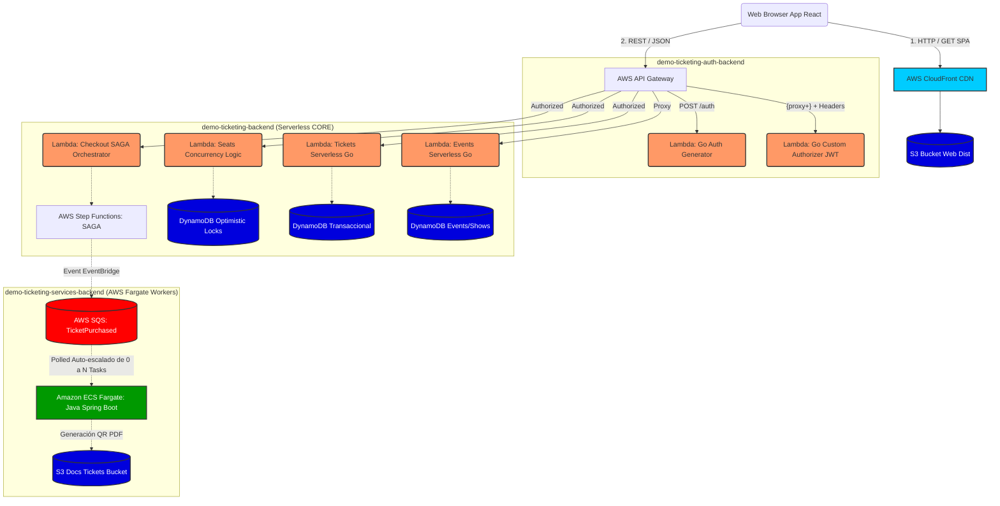
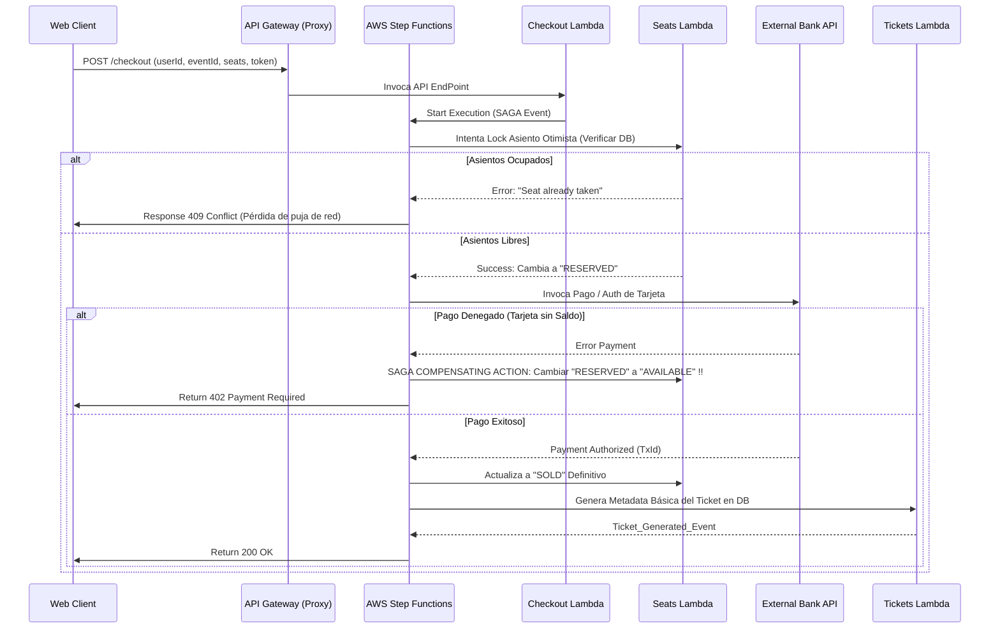
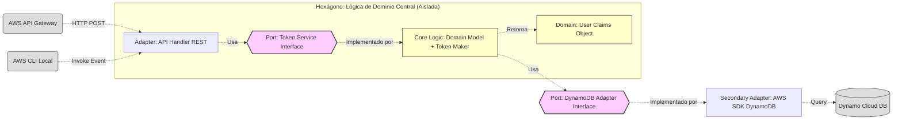

# Diagramas de Arquitectura

Este documento contiene los diagramas de arquitectura de la plataforma `demo-ticketing`.

Cada sección incluye **dos formatos**:
- 🖼️ **Diagrama PNG con íconos AWS oficiales** (generado con la librería `diagrams` de Python + Graphviz)
- 📐 **Diagrama Mermaid** (para edición rápida inline directamente en GitHub)

**Región principal:** `us-east-1` (N. Virginia) — *Reason: mayor disponibilidad de servicios Free Tier y latencia optimizada para LATAM.*

---

## Requisitos para regenerar los diagramas PNG

```bash
brew install graphviz
python3 -m venv venv && source venv/bin/activate
pip install diagrams
python3 generate_diagram.py
python3 generate_saga_diagram.py
python3 generate_auth_diagram.py
```

## 1. Arquitectura de Despliegue General en AWS

Este diagrama ilustra cómo las solicitudes de los usuarios fluyen desde el browser a través de **WAF → CloudFront → API Gateway** hacia los distintos microservicios. Detalla:
- **Región:** `us-east-1`, **AZ:** `us-east-1a` y `us-east-1b`
- **WAF** para protección OWASP en borde
- **CloudFront** para CDN del Frontend SPA
- **API Gateway** como único punto de entrada
- **Lambdas Go** para lógica de Auth y APIs Core
- **ECS Fargate** para workers Java de larga duración
- **DynamoDB** (multi-AZ) para almacenamiento NoSQL
- **EventBridge + SQS** como bus de eventos asíncronos

### 🖼️ Diagrama AWS




---

## 2. Flujo de Transacción SAGA (Proceso de Checkout y Compensaciones)

Describe el mecanismo Core de compra de Ticketera: un patrón de microservicios distribuido "Saga" (Orquestado por Step Functions y Lambda), garantizando consistencia atómica sin bloquear registros globalmente (Optimistic Locking). Detalla:
- **Región:** `us-east-1`, **AZ:** `us-east-1a` (transaccional) y `us-east-1b` (async workers)
- **Compensating Actions** en caso de fallo de pago
- **DynamoDB** Optimistic Lock para asientos
- **SQS + ECS Fargate** para procesamiento asincrónico tras el pago exitoso

### 🖼️ Diagrama AWS


### 📐 Diagrama Mermaid


---

## 3. Auth & Security Flow

Visualiza el flujo de autenticación y autorización de la plataforma de extremo a extremo. Detalla:
- **WAF** como primer filtro OWASP en borde
- **CloudFront** como capa intermedia distribuidora de peticiones
- **API Gateway** enrutando a las Lambdas especializadas de Auth
- **Custom Authorizer** (Go/Hexagonal) validando JWT en cada request protegido
- **Secrets Manager** almacenando el secreto `JWT_SECRET` de forma segura
- **Cognito** preparado para futura integración de SSO/Active Directory

### 🖼️ Diagrama AWS


### 📐 Diagrama Mermaid (Hexagonal Architecture)

