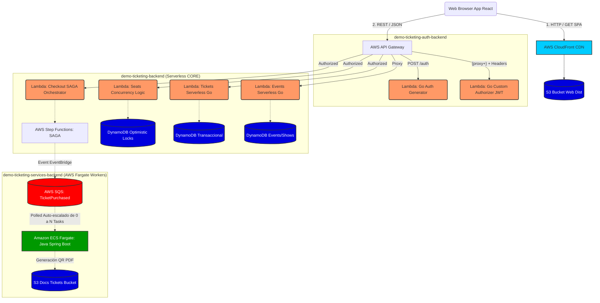
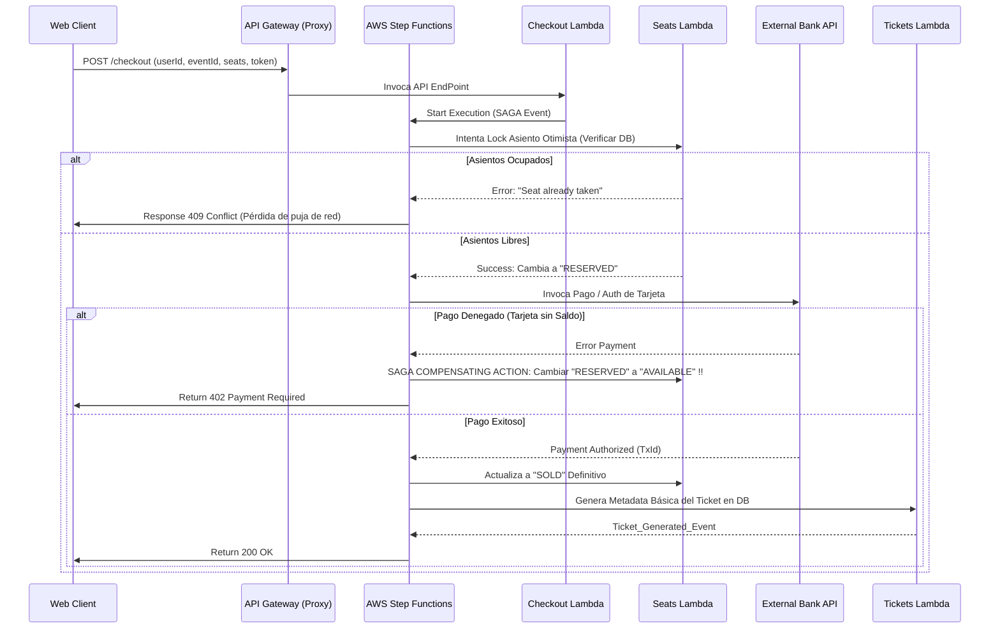
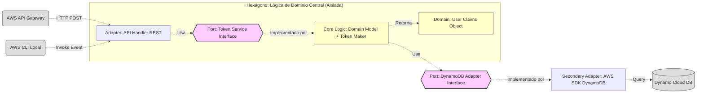

# Diagramas de Arquitectura (Mermaid)

Este documento contiene los diagramas de arquitectura de nuestra plataforma, utilizando formato **Mermaid** (soportado nativamente por GitHub).

## 1. Arquitectura de Despliegue General en AWS

Este diagrama ilustra cómo las solicitudes de los usuarios entran desde el navegador y viajan a través del ecosistema AWS en el backend Serverless y Docker ECS Fargate de larga duración.

---

## 2. Flujo de Transacción SAGA (Proceso de Checkout y Compensaciones)

Describe el mecanismo Core de compra de Ticketera: un patrón de microservicios distribuido "Saga" (Orquestado por Step Functions y Lambda), garantizando consistencia atómica sin bloquear registros globalmente (Optimistic Locking).

---

## 3. Patrón de Diseño Hexagonal (Arquitectura Limpia y Go Lambdas)

Visión de la estructura interna del código en Golang del backend Core y Auth (Puertos y Adaptadores).

