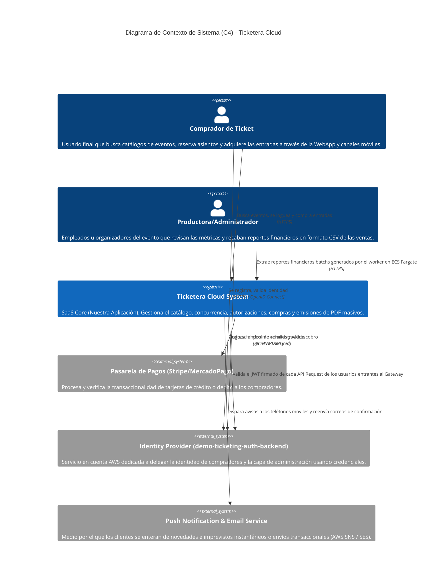

# Diagrama C4 (Contexto)

Este diagrama C4 de Nivel 1 (Context) expone el límite del sistema de toda la Ticketera Cloud en relación a sus actores y dependencias externas. Es un vistazo a "20,000 pies de altura" para entender el alcance final del proyecto desde una perspectiva de dominio de software.

## Nivel 2: Diagrama de Contenedores

Este diagrama detalla los servicios internos que conforman el sistema "Ticketera Cloud".

