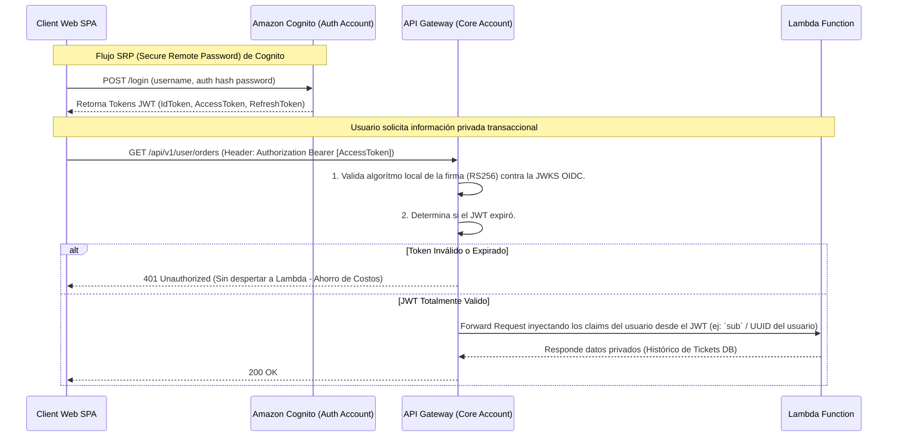

# Diagrama de Autenticación Centralizada y Seguridad (Login)

La topología de seguridad se encuentra gobernada por **Amazon Cognito** (dentro del repositorio e infraestructura `demo-ticketing-auth`).

**Sobre JWT:** Amazon Cognito es 100% compatible con los estándares de OpenID Connect (OIDC) y OAuth2. Esto significa que **sí, Cognito utiliza directamente tokens JWT**. Cuando un usuario se autentica de forna exitosa, Cognito emite:
1.  **Id_Token**: Un JSON Web Token (JWT) que contiene claims sobre la identidad directa del usuario (Email, Nombre, ID Subjetivo de usuario).
2.  **Access_Token**: JWT que dicta "Qué permisos tiene" a nivel Oauth. Fundamental porque el `Amazon API Gateway` del Core puede validar nativa e instantáneamente si la firma asimétrica de este token corresponde y el rol inyectado está activo, sin consultar a Cognito.
3.  **Refresh_Token**: Un token ofuscado que emite nuevos Access Tokens a las 24hs automáticamente, manteniendo al usuario logueado en su teléfono pero bloqueándolo si el admin decide cerrarle la cuenta en el backend.

