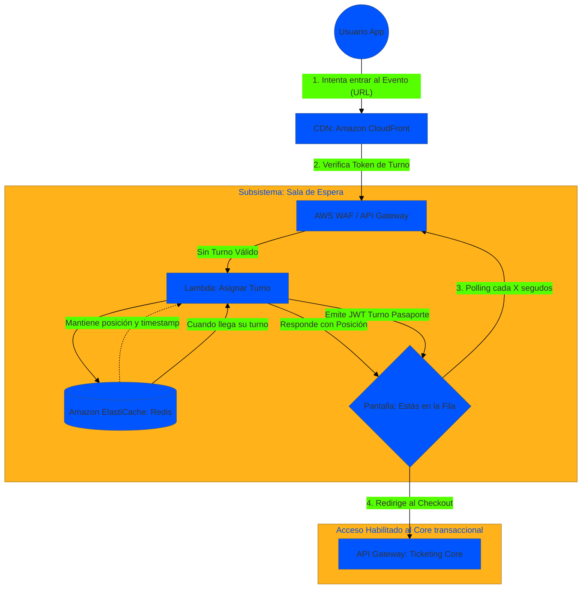

# Arquitectura de la Sala de Espera Virtual (Virtual Waiting Room)

El componente más crítico de un sistema de "Flash Sales" (Venta Masiva) es evitar sobrecargar el Core de la aplicación. Para lograrlo, la arquitectura incorpora una **Sala de Espera Virtual**.

El objetivo primario de la sala de espera no es solo proteger las bases de datos (Throttling), sino también entregar una experiencia de usuario transparente, indicándole cuántas personas tiene adelante y un tiempo estimado de espera sin que sienta que la página "se colgó".

## 1. Diseño Arquitectónico (Implementación Cloud-Native)

Se opta por un diseño apoyado fuertemente en **Caché y Mensajería Rápida (ElastiCache - Redis / SQS)**, donde la fila se administra fuera de los componentes transaccionales lentos.

## 2. Flujo Explicado (Paso a Paso)

1. **Intento de Acceso al Evento**: Miles de usuarios hacen click en "Comprar Entrada" simultáneamente a las 10:00 AM.
2. **Evaluación de Pase (Passport Token)**: El API Gateway (o Edge Lambda) evalúa si el usuario posee un `JWT de Ingreso Activo`. Como no lo tiene, es derivado al subsistema de la Sala de Espera.
3. **Ingreso a la Fila (Queueing)**: Una Lambda liviana inscribe el ID del usuario en una estructura ordenada de alta velocidad (Redis Sorted Sets en ElastiCache). Le retorna su posición actual (Ej: "Eres el nro. 4500").
4. **Polling Visual en el Front-End**: La aplicación web se queda en una pantalla que hace un "pálpito" (polling) cada 10 segundos para actualizar su número. *"Quedan 200 personas delante tuyo"*.
5. **Liberación Controlada (Draining)**: Un worker o cron job (ej. Step Functions) revisa cuántos usuarios han terminado de comprar o abandonaron en los últimos minutos. Según la capacidad técnica o las reglas de negocio de la ticketera, libera un batch de N personas actualizando el estado de sus turnos en Redis.
6. **Autorización y Pase Libre**: En el siguiente polling, al usuario N le toca pasar. La Lambda le emite un "Pase JWT Firmado" temporal (válido por 10 minutos). La UI lo redirige al flujo de **Checkout (SAGA)**. El Gateway principal del Core deja pasar la compra porque la petición posee el pase temporal válido.
